# Actividades Unidad 3
## Actividad 2.- Configuración de Contraseñas Seguras en Windows y Linux 
Para aplicar directivas de seguridad en windows es tan sencillo como irnos a directivas de seguridad local y en Directivas de cuentas -> Directivas de contraseñas establecer las directivas que nosotros queramos.

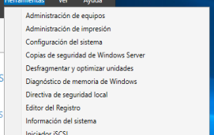

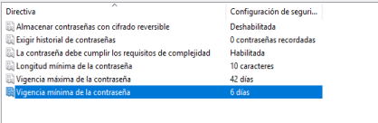

En Linux sería al ponerle contraseña debemos poner una serie de banderas:

-n (número de caracteres)

-x (duración de la contraseña)

-w (aviso de cuantos días le quedan a la contraseña)

-i (número de intentos)

## Actividad 3- Ataques contra contraseñas en Sistemas Windows

No hecho

## Actividad 4- Ataques contra contraseñas en Sistemas Windows

Se puede descubrir las contraseñas con rainbowcrack desde el el fichero 
_C:\Windows\System32\config\SAM_

Para sacar el archivo SAM podemos utilizar varias formas yo lo he sacado mediante un metasploit que escucha por el puerto 443 y pues para ello necesito una máquina con servidor web y con estos comandos  y metaexploits escuchamos por ese puerto:

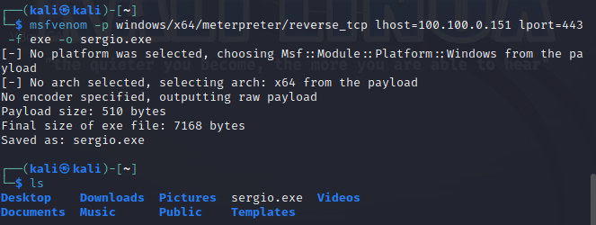
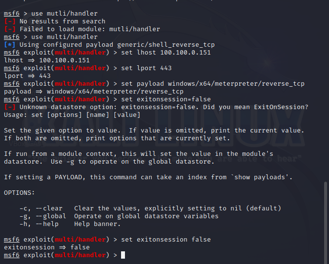

Tras lanzarlo lo buscamos en la otra máquina y entramos en la session de ahí nos la descargamos el archivo SAM y crackeamos las contraseñas hash ya sea con john u otra aplicación que descubhra contraseñas hash

Para resetear las contraseñas de Windows yo he utilizado ultimate boot cd por lo que he descargado la iso y la he instalado en un dispositivo

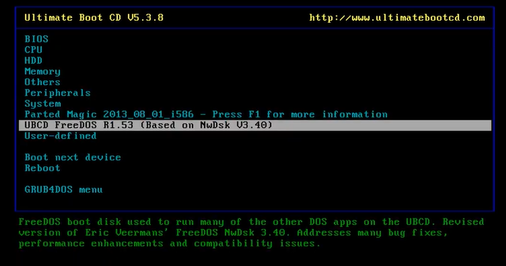

seleccionamos parted magic y cuando estemos en la interfaz gráfica utilizamos la aplicación pc login now y seleccionamos el sistema y el usuario y seleccionamos que esté vacía

Al meternos en la cuenta veremos que podemos seleccionar no poner contraseña por lo que podremos cambiarle la contraseña

## Actividad 5.- Ataques contra contraseñas en Sistemas Linux 

Para esta actividad vamos a utilizar jhon the Ripper y backtrack si utilizamos una distribución kali ya las tenemos instaladas por eso solamente son comandos. Si queremos saber las contraseñas de los usuarios realizamos un john /etc/shadow y solucionado

## Actividad 6.- Realiza un listado de Congeladores este tipo de herramientas y analiza la instalación y configuración de 2 congeladores

Para esta actividad me he encontrado muchas aplicaciones que realizan esta función algunas ya no se usan o no se pueden usar por ser demasiado antiguas o por otro tipo de motivo pero aún sigue habiendo documentación sobre ellas.

Su función es realizar una copia de seguridad para que si tu instalas algo puedas volver a donde estabas tras reiniciar el sistema y no afecta en nada al dispositivo esto es beneficioso para realizar pruebas

Sin uso 

Windows Steady State: Solo funcionaba con Windows xp y vista 

toolwiz-time-freeze: No funciona su página oficial y de segundas no me fio

Que se pueden usar (aunque hay)

Deep Freeze

NetBit Recovery

Comodo time machine

Yo he utilizado Deep Freeze y RollBack (los dos con pruebas gratuitas)

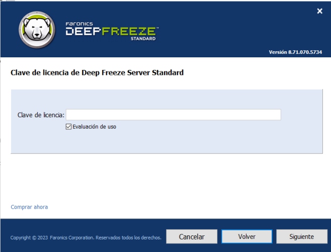
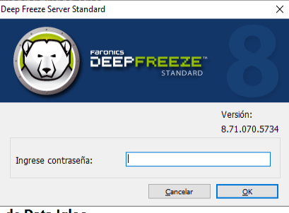
Tras la instalación debemos presionar Ctrl +Shift + Alt +f6 Para poder acceder al menú

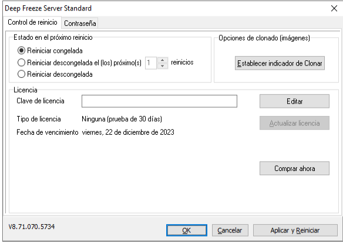
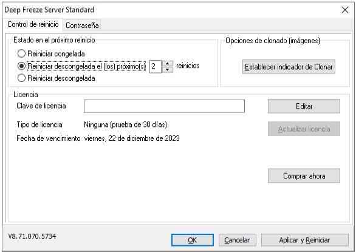

RollBack

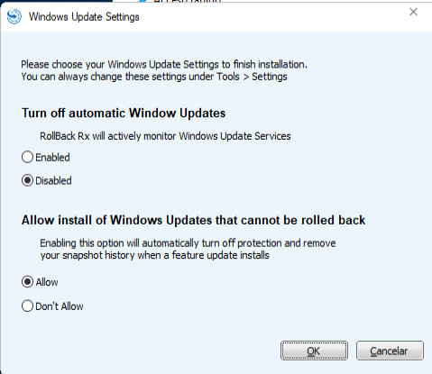
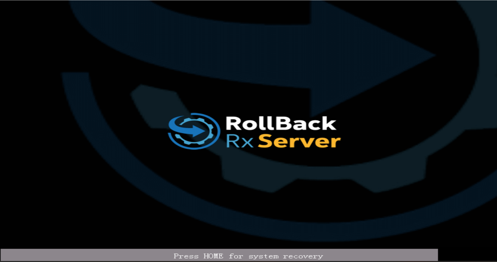

## Actividad 7: GRUB.
Debemos añadir estas líneas en el fichero /etc/grub.d/00_header

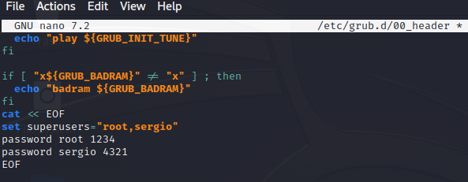

grub-mkpasswd-pbkdf2 Nos pedirá la nueva contraseña y tendremos que poner el resultante donde tenemos la contraseña (sergio es un usuario que tengo creado pero no es importante es solo de prueba) 

Luego tendremos que poner --unrestricted el fichero /etc/grub.d/10_linux
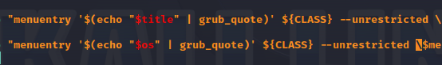
Para hacer esto podemos presionar Ctrl + w y buscar menuentry.
y yasta con esto esta partición esta segura con el grub
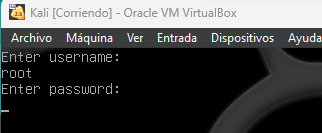
## Actividad 8

No está hecho
